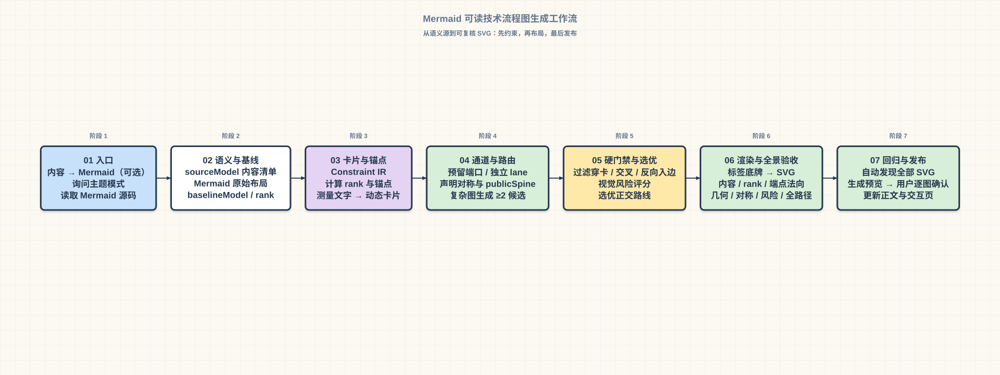

# Mermaid 可读技术流程图生成工作流

这是一个面向技术文章、学习笔记和架构文档的 Mermaid 流程图排版工作流。

它支持两种使用入口：已有 Mermaid 源码时直接进入确定性排版；只有文章或知识点时，先由人工或 LLM 整理成 Mermaid，再进入同一条排版与验收链。当前仓库的 CLI 从 `.mmd` 开始，不会擅自替用户生成技术语义。

它解决的不是“能不能画出 Mermaid”，而是 Mermaid 图在真实文章中经常出现的可读性问题：卡片留白不协调、文字过小、箭头方向错误、线路打结、对称分支失衡、范围框越界，以及局部看起来正确但全景难以理解。

## 它做什么

工作流以 Mermaid 源码作为技术语义唯一来源，以 Mermaid 原始渲染结果作为布局基线，再通过确定性的 SVG 渲染和 QA 生成适合阅读的技术图。

```mermaid
flowchart LR
    Content[文章 / 知识点（可选）] -.人工或 LLM 整理.-> Source[Mermaid 源码]
    Source --> Model[sourceModel 内容模型]
    Model --> Baseline[Mermaid baselineModel]
    Baseline --> Measure[文字测量与动态卡片]
    Measure --> IR[Constraint IR 约束中间表示]
    IR --> Layout[layoutModel 布局与正交路由]
    Layout --> SVG[确定性 SVG 渲染]
    SVG --> QA[结构 / 几何 / 视觉 QA]
    QA --> Preview[全景预览与用户确认]
    Preview --> Article[文章或文档发布]
```



## 工作流成品演示

下面这张图就是用本仓库工作流生成的演示图。它把完整流水线压缩成七个连续阶段，卡片内保留关键子步骤；节点、箭头、字号、间距和主题都由确定性 SVG 渲染器生成。



主题只改变视觉层，不改变内容和几何。仓库同时提供四套同尺寸主题预览：

| 主题 | 预览 |
|---|---|
| `paper` | [打开 paper 主题](examples/output/kmp-core-preview-00-workflow-overview-paper.svg) |
| `mint` | [打开 mint 主题](examples/output/kmp-core-preview-00-workflow-overview-mint.svg) |
| `warm` | [打开 warm 主题](examples/output/kmp-core-preview-00-workflow-overview-warm.svg) |
| `mist` | [打开 mist 主题](examples/output/kmp-core-preview-00-workflow-overview-mist.svg) |

## 怎么调用

### 1. 直接排版已有 Mermaid

```powershell
# 使用固定主题
npm run render -- warm

# 当前批次随机抽取一次主题，并在日志中输出实际主题
npm run render -- random

# 独立生成工作流演示图的四套主题
npm run render:demo -- all

# 全量渲染、演示图生成和 QA
npm run check
```

### 2. 从文章内容进入

先把文章中的一个知识点整理为 `.mmd`，保存到 `examples/mermaid/`，再执行上面的渲染命令。建议遵循：

`内容拆解 → Mermaid 草稿 → 节点/边/方向核对 → 主题选择 → 渲染与 QA`

这一步可以由 LLM 协助，但必须由人确认技术语义；图片模型不能直接决定精确节点、箭头关系或线路端点。

## 为什么需要它

- **语义不丢失**：节点、边、方向、分支标签和时序消息都从 Mermaid 提取，不能由图片模型自由改写。
- **比例更自然**：卡片宽高根据实际文字测量、换行和字号计算，避免所有矩形被硬编码成同样大小。
- **线路更可读**：优先使用水平/垂直直线，动态分配独立通道，检查目标边界法向，防止箭头反向进入。
- **对称有依据**：对称不仅检查卡片，还检查折点、通道、入边和箭头；公共脊柱必须显式声明。
- **结果可复核**：SVG 写入主题、箭头规格、baseline、对称边对等元数据，QA 能够独立复查。
- **适合持续集成**：新增或修改 SVG 后，可以由 GitHub Actions 自动检查重叠、穿卡、交叉和非法共享线段。

## 六层模型

| 层 | 作用 | 不能做什么 |
|---|---|---|
| `sourceModel` | 保存 Mermaid 节点、边、标签和消息 | 不能擅自补充业务语义 |
| `baselineModel` | 保存 Mermaid 画布、rank、出口顺序和基本布局 | 不能被一套无依据的手工图替代 |
| `measureModel` | 测量字体、换行和卡片自然尺寸 | 不能为了塞进画布无限缩小文字 |
| `layoutModel` | 处理 rank、锚点、端口、通道、对称和正交路径 | 不能改变 Mermaid 的连接关系 |
| `visualModel` | 管理主题、网格、颜色、描边、阴影和箭头 | 不能用颜色掩盖结构问题 |
| `symmetrySpec` | 声明严格/局部对称、节点对、边对和公共脊柱 | 不能把局部对称宣传成全图对称 |

## 推荐执行顺序

1. （可选）把文章或知识点整理为 Mermaid 草稿。
2. 询问主题模式，再读取 Mermaid 源码并建立内容清单。
3. 生成或读取可信的 Mermaid baseline。
4. 判断流程类型：线性、分支、闭环、时序或分层架构。
5. 依照 baseline 的 rank 和出口顺序建立布局草图。
6. 测量文字并动态计算卡片宽高、换行和间距。
7. 建立 Constraint IR，声明端口、独立 lane、避让区域和对称关系。
8. 生成正交路线，复杂图保留候选方案；严格镜像且适合时才使用 `publicSpine`。
9. 运行渲染前硬校验：端点、法向、穿卡、交叉、非法共享、范围框和箭头规格。
10. 放置标签底牌，生成带元数据的 SVG，并运行全量 QA。
11. 查看缩放后的全景图，用户逐图确认后再替换文章资源。

## 硬门禁与视觉警告

以下问题会阻断生成或使 QA 失败：

- 节点、边、方向或内容不一致；
- 卡片重叠、线路穿卡、真实横竖交叉；
- 起点/终点未连接，或箭头从错误的边界法向进入；
- 未声明的共享线段；
- 范围框越界；
- 普通流程箭头不是 `16×12px`，时序箭头不是 `24×16px`。

以下问题会作为带数值的视觉警告输出，并要求在新图预览前处理：

- 末段箭头过短；
- 平行线距离过近且投影重叠；
- 标签贴线或底牌造成“断线”错觉；
- 折点形成视觉打结；
- 整体重心明显偏移。

## 快速开始

需要 Node.js 18 或更高版本。本仓库的参考实现不依赖外部 npm 包。

```powershell
npm run render -- warm
npm run qa
```

主题选择：

```powershell
# 固定主题
npm run render -- paper
npm run render -- mint
npm run render -- warm
npm run render -- mist

# 当前批次随机选择一套主题，并在日志中输出实际主题
npm run render -- random
```

普通流程图使用 `16×12px` 箭头；时序图使用已确认的 `24×16px` 箭头。主题只改变视觉层，不改变节点、卡片尺寸和线路几何。

## 目录结构

```text
workflow/       完整工作流规范
src/            确定性 SVG 渲染器与 QA
examples/
  mermaid/      Mermaid 内容源
  baseline/     Mermaid 原始布局基线
  output/       最终 SVG 示例
docs/           补充说明
.github/        GitHub Actions 自动校验
```

## 当前能力边界

这是一个“流程规范 + 确定性参考实现 + 示例集”，不是已经完成的通用自动布局引擎。当前示例仍为每张图提供明确的布局和路由定义，渲染器负责对这些定义执行统一硬校验；通用的多候选正交路由求解器、自动布局模板和更完整的字体跨平台测量属于后续路线。

这一区分很重要：规则可以先稳定复用，自动求解能力再逐步增强，避免为了追求自动化而牺牲技术语义和图形可读性。

## 参与贡献

新增图时请同时提交：

- Mermaid 源码；
- Mermaid baseline；
- `sourceModel` 内容核对结果；
- 对称、端口、lane 和范围框约束；
- 最终 SVG；
- `npm run qa` 的结果和必要的视觉说明。

不要直接在 SVG 上手工补线，也不要用截图裁切掩盖越界或重叠问题。

## 许可证

本项目使用 MIT License，详见 [LICENSE](LICENSE)。
